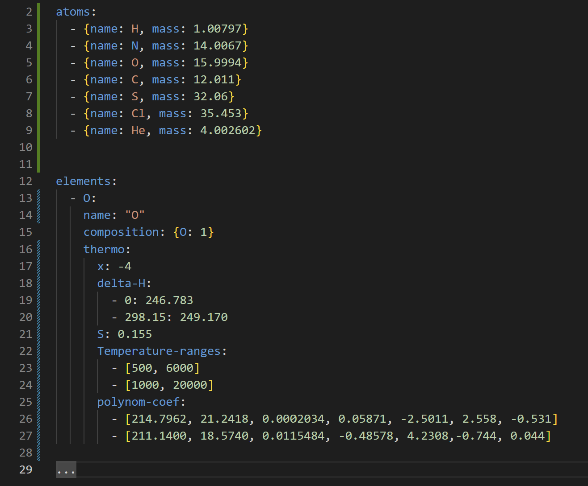

# Инструкция по заполнению таблицы

---

1. Создать словарь "elements"
2. В созданном словаре создать словарь с именем элемента (например O)
3. В словаре элемента создать ключи:

    * composition - словарь, в котором ключ - название элемента,
    а значение - число этих атомов в химической формуле

    * atom-mass - атомарная масса

    * delta-H - список, в котором содержится энтальпия нуля и комнатной тепературы

    * S - энтропия

    * Temperature-ranges - список интервалов температур, задаваемые одномерным массивом

    * polynom-coef - коэффициенты полинома расчета термодинамических функций по таблице Гурвича
4. Перейти к следующему элементу

Искать нужные данные в таблице Гурвича (том 2).

Пример заполнения таблицы представлен на рисунке ниже:

Для облегчения копирования данных из таблицы можно использовать microsoft power toys (доступен в Microsoft store). С помошью комбинации клавиш win (super) + shift + T выделить необходимую для копирования область

